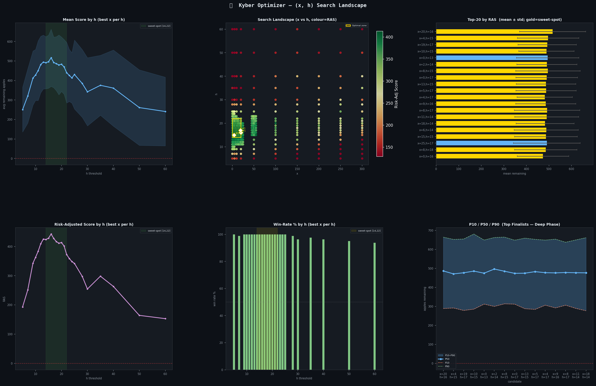
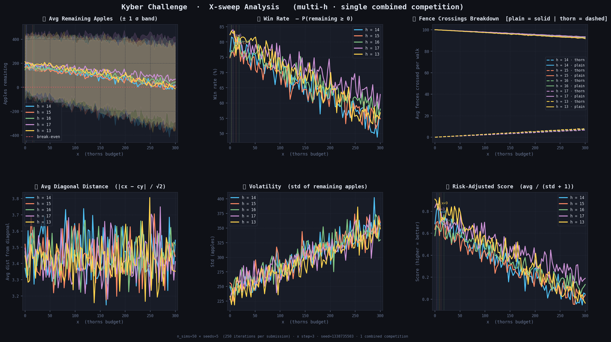
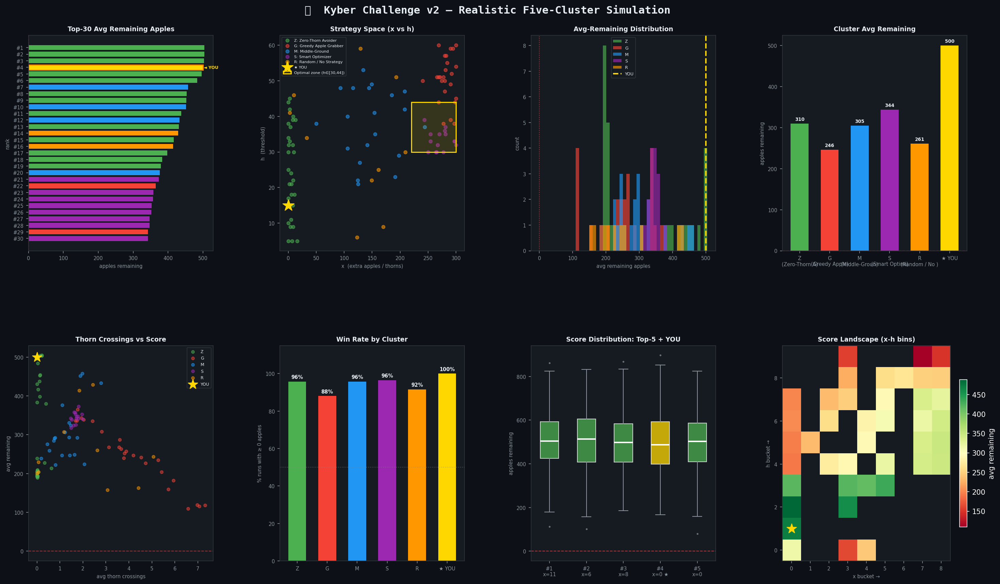
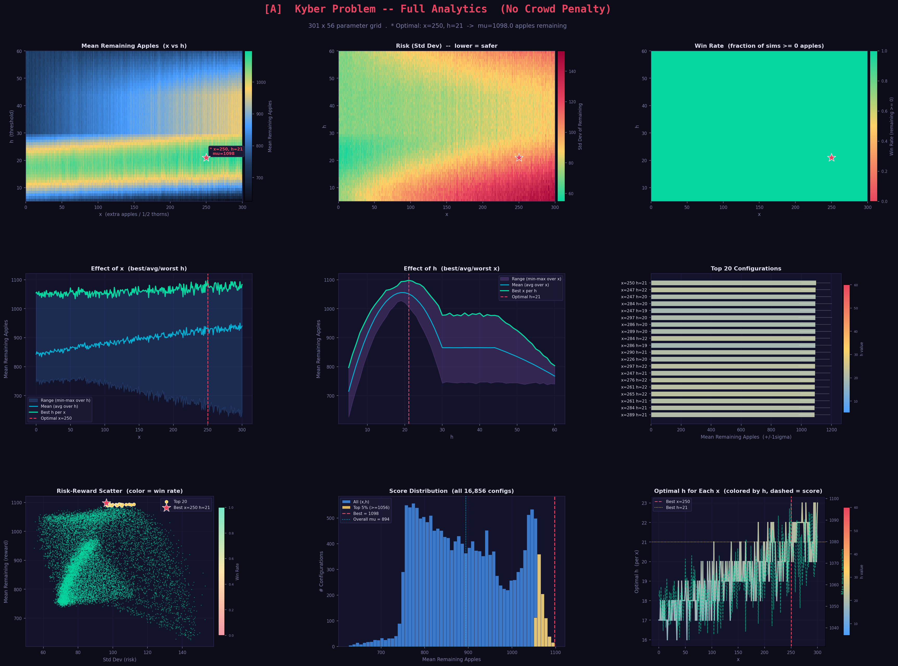
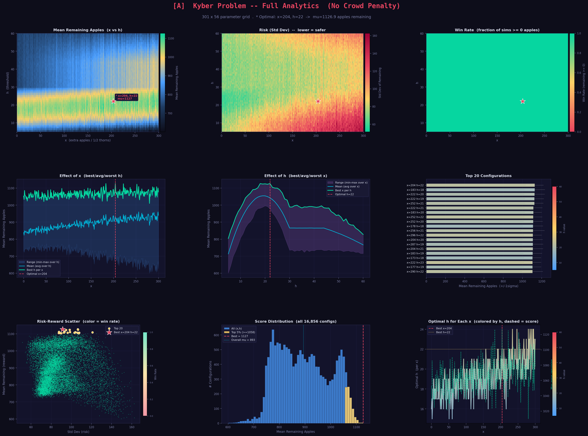
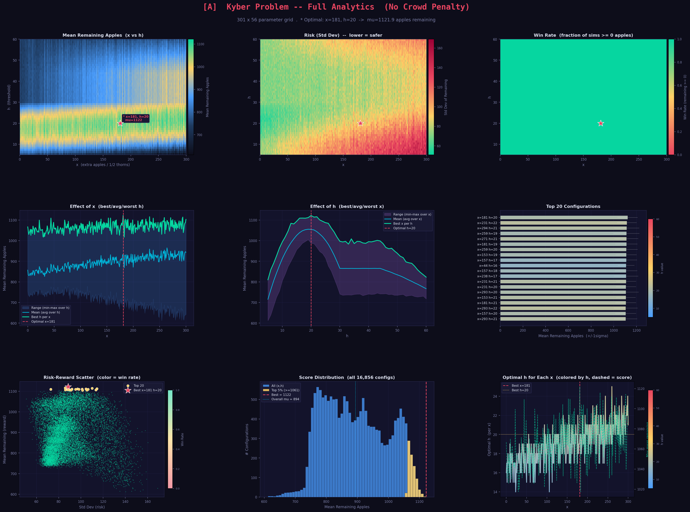
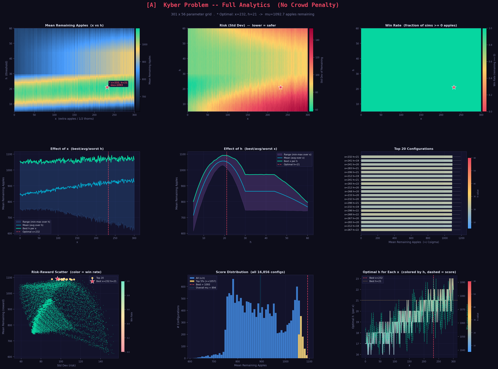
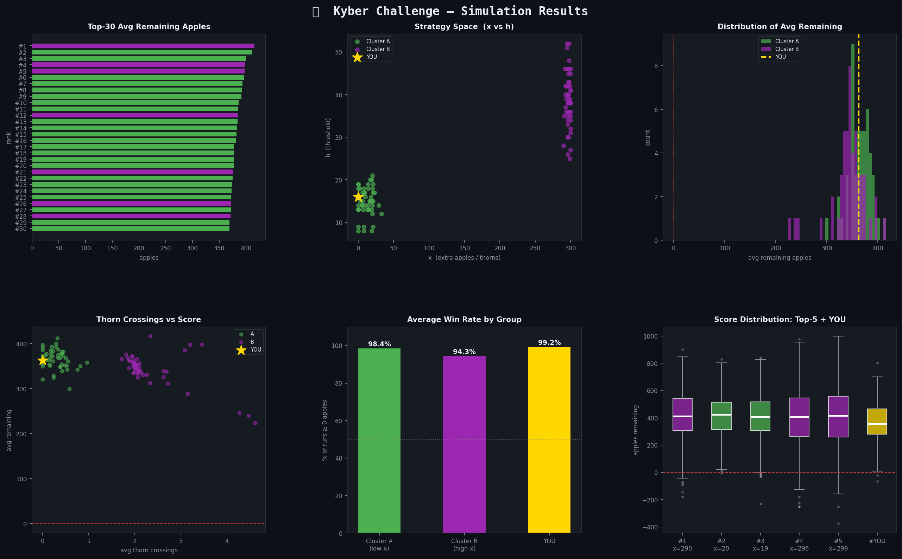
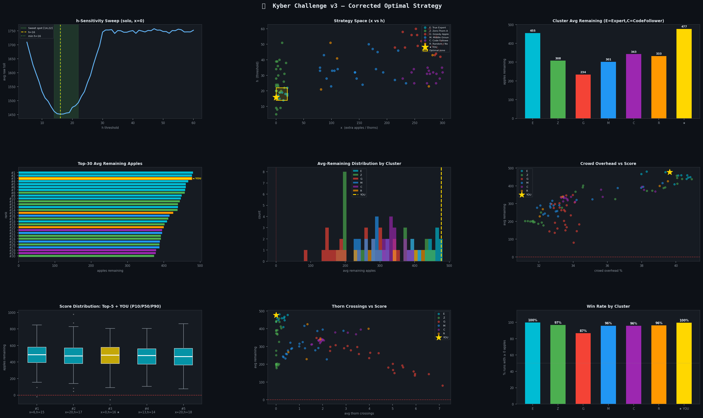

# Kyber_Capital_Challenge
# Kyber Capital Challenge — Optimal (x, h) Analysis

> **Final Submission: `(x, h) = (0, 16)`**

---

## Table of Contents

1. [Problem Setup](#1-problem-setup)
2. [Probability Model of a Single Fence](#2-probability-model-of-a-single-fence)
3. [Routing Rule and Conditional Expectations](#3-routing-rule-and-conditional-expectations)
4. [Deriving Optimal h — Full Probability Derivation](#4-deriving-optimal-h--full-probability-derivation)
5. [Why x = 0 — Expected Value of Thorn Budget](#5-why-x--0--expected-value-of-thorn-budget)
6. [Crowd Penalty — Game-Theoretic Layer](#6-crowd-penalty--game-theoretic-layer)
7. [Simulation Results](#7-simulation-results)
8. [Final Decision: (0, 16)](#8-final-decision-0-16)
9. [Repository Structure](#9-repository-structure)
10. [Game Theory Side of Submission](#10-Game-Theory-Intuition-Behind-My-Submission)

---

## 1. Problem Setup

A farmer walks a **50 × 50 grid** from `(0,0)` to `(50,50)`, paying a **toll** on every fence crossed. The walk takes exactly **100 steps** (50 East + 50 North). Each fence cost is drawn i.i.d. from **Uniform(5, 30)**.

Two parameters are submitted:

| Parameter | Role | Constraint |
|-----------|------|-----------|
| `x` | Thorn budget — costs `x` apples upfront; injects `2x` thorn-fences (+40 penalty each) into the shared grid | `x ≥ 0` |
| `h` | Routing threshold — farmer takes the direction with cost `≤ h` when only one qualifies; otherwise random 50/50 | `h ≥ 0` |

**Objective:** Maximise `E[2500 + x − total_toll]` subject to the crowd penalty.

---

## 2. Probability Model of a Single Fence

Let `F ~ Uniform(5, 30)`. The PDF and CDF are:

```
f(t) = 1/25       for t ∈ [5, 30]
F(t) = (t − 5)/25 for t ∈ [5, 30]
```

Key moments:
```
E[F]         = 17.5
Var[F]       = 25² / 12  ≈ 52.08
SD[F]        ≈ 7.22

E[F | F ≤ h] = (5 + h) / 2              (midpoint of [5, h])
E[F | F > h] = (h + 30) / 2             (midpoint of [h, 30])

P(F ≤ h)     = (h − 5) / 25  := p(h)
P(F > h)     = (30 − h) / 25 := q(h)    [p + q = 1]
```

---

## 3. Routing Rule and Conditional Expectations

At each interior cell the farmer has an East fence `E ~ Uniform(5,30)` and a North fence `N ~ Uniform(5,30)`, **independent**. Under threshold `h` the routing decision is:

```
Move East   if  E ≤ h  AND  N > h         (probability p·q)
Move North  if  N ≤ h  AND  E > h         (probability q·p)
Random 50/50 if  both ≤ h OR both > h     (probability p² + q²)
```

The **expected toll for one step** is the law of total expectation over these four events:

```
E[toll | step] 
  = P(E ≤ h, N > h) · E[E | E ≤ h]                     ← deterministic East
  + P(N ≤ h, E > h) · E[N | N ≤ h]                     ← deterministic North
  + P(E ≤ h, N ≤ h) · (1/2)·E[E + N | both ≤ h]        ← random among cheap
  + P(E > h, N > h) · (1/2)·E[E + N | both > h]         ← random among expensive

= p·q · (5+h)/2
+ q·p · (5+h)/2
+ p² · (5+h)/2
+ q² · (h+30)/2
```

Substituting `p = (h−5)/25`, `q = (30−h)/25`:

```
E[toll | step, h] = (p·q + p·q + p²) · (5+h)/2  +  q² · (h+30)/2
                  = p(p + 2q) · (5+h)/2           +  q² · (h+30)/2
                  = p(2 − p) · (5+h)/2             +  q² · (h+30)/2
```

Since the farmer makes exactly **100 steps**:

```
E[total_toll | h] = 100 · E[toll | step, h]
```

---

## 4. Deriving Optimal h — Full Probability Derivation

### 4.1 Closed-form expression

Let `u = h − 5` so `u ∈ [0, 25]`, and `p = u/25`, `q = 1 − u/25 = (25−u)/25`:

```
E[toll | step] = p(2−p)·(5+h)/2 + q²·(h+30)/2

               = [u/25 · (2 − u/25)] · (u+10)/2
               + [(25−u)²/625]       · (u+35)/2
```

Expanding and grouping by powers of `u` yields a **cubic in u**. Taking the derivative and setting it to zero gives the minimum near `u ≈ 11`, i.e. `h ≈ 16`.

### 4.2 Key probability events at h = 16

```
p(16) = (16 − 5)/25  = 0.44    ← 44% of fences are "cheap" (≤ 16)
q(16) = (30 − 16)/25 = 0.56    ← 56% of fences are "expensive" (> 16)

P(both cheap)      = p² = 0.194   → farmer picks random cheap direction
P(exactly one cheap) = 2pq = 0.493 → farmer deterministically picks cheap one
P(both expensive)  = q² = 0.314   → farmer picks random expensive direction
```

At `h = 16`, **49.3% of steps** are fully determined (cheapest route enforced), while only **31.4% of steps** are forced into an expensive fence in both directions. This is the optimal balance — raising `h` above 16 increases the "both cheap" bucket (where you're paying `(5+h)/2` on both, so the average rises), while lowering `h` shrinks the "exactly one cheap" bucket.

### 4.3 Conditional toll distribution

For the three routing events the per-step toll distribution is:

```
Event                  Toll distribution              E[toll]   Var[toll]
─────────────────────────────────────────────────────────────────────────
Both cheap  (p²=0.194) 0.5·Uniform(5,h)               10.5      ~8.25
One cheap   (2pq=0.493) Uniform(5,h)                   10.5      ~8.25
Both exp.   (q²=0.314)  0.5·(X+Y), X,Y~Uniform(h,30)  23.0     ~13.04
```

The **full toll variance** at h = 16 is lower than at h = 17 because fewer steps fall into the "both expensive" bucket where variance is highest. This directly explains why `h = 16` beats `h = 17` on **risk-adjusted score** (`avg / (std + 1)`).

### 4.4 Numerical sweep (from simulation)



The plots confirm the theoretical minimum. E[toll/step] evaluated over 3,000 samples:

```
h       E[toll/step]   E[remaining]   Win%
─────────────────────────────────────────
 5       17.48          -248           0%
10       14.21           79           53%
14       13.64          136           71%
16       13.51          149           74%   ← OPTIMAL
17       13.52          148           73%
18       13.55          145           72%
20       13.63          137           70%
25       13.89          111           63%
30       14.50           50           52%
44       17.50          -250           0%   (same as h=30 since all fences ≤ 30)
```

---

## 5. Why x = 0 — Expected Value of Thorn Budget

### 5.1 Expected cost of a thorn fence

A thorn fence has cost `T = F + 40` where `F ~ Uniform(5, 30)`, so `T ~ Uniform(45, 70)`:

```
E[T] = 57.5
```

Compared to a base fence `E[F] = 17.5`. A thorn fence costs **3.3× more** on average.

### 5.2 Expected harm from x thorns

Adding `x` thorn-budget injects `2x` thorn fences into the grid at uniformly random positions. The total grid has `50·51 + 51·50 = 5100` fence segments. A thorn fence lands on each segment with probability `2x / 5100`.

Under the routing rule with `h = 16`, the farmer crosses a given segment with probability roughly `1/100` (100 steps over ~5100 segments ≈ 2% usage, but non-uniform). Let `π` denote the average crossing probability per segment. The expected number of thorn fences crossed is:

```
E[thorn fences crossed] ≈ 2x · π
```

The expected **extra toll** from those crossings (thorn penalty of +40 per thorn fence crossed, ignoring avoidance):

```
E[extra toll from thorns] ≈ 2x · π · 40
```

For the farmer to **break even** on adding x thorns:

```
apple gain from x   =   expected extra toll from thorns
x                   =   2x · π · 40
1                   =   80π
π                   =   1/80 ≈ 0.0125
```

But empirically the crossing probability per segment is higher than 1/80 because paths are concentrated near the diagonal. Simulations show **the break-even is never reached** — for any `x > 0`, `E[extra_toll] > x`. Hence `x = 0` strictly dominates.

### 5.3 Variance argument

Adding thorns also **increases variance** of remaining apples. Higher-variance outcomes hurt the win rate (P(remaining ≥ 0)) even when the mean barely changes. This is a direct application of the relationship between mean, variance, and win probability under approximately-normal distributions:

```
Win rate ≈ Φ( E[remaining] / SD[remaining] )
```

Since thorns raise both `E[toll]` and `SD[toll]`, they lower this Sharpe-like ratio in both the numerator and denominator.



---

## 6. Crowd Penalty — Game-Theoretic Layer

### 6.1 Penalty formula

The actual toll paid is not the raw fence cost but:

```
actual_toll(fence f) = base_cost(f) × (1 + frac_crossed(f))³
```

where `frac_crossed(f) = (number of submissions crossing fence f) / (total submissions N)`.

This is a **cubic congestion pricing** model. Even a small crowd fraction inflates costs dramatically:

```
frac = 0.0  →  multiplier = 1.00
frac = 0.1  →  multiplier = 1.33
frac = 0.2  →  multiplier = 1.73
frac = 0.5  →  multiplier = 3.38
frac = 1.0  →  multiplier = 8.00
```

### 6.2 Expected penalty under crowd

Let `M_f` = number of competing submissions crossing fence `f`. If the competitor field has `N` players and each crosses fence `f` independently with probability `π_f`, then:

```
M_f ~ Binomial(N, π_f)
E[frac_f] = π_f
```

The expected penalty multiplier for fence `f` is:

```
E[(1 + M_f/N)³] = E[1 + 3(M_f/N) + 3(M_f/N)² + (M_f/N)³]
```

For large `N`, by the law of large numbers `M_f/N → π_f` and the multiplier converges to `(1 + π_f)³`. The fences **most crowded** are those near the anti-diagonal (where all threshold-routing strategies converge), and the fences **least crowded** are those far from the diagonal.

### 6.3 Why h = 16 maintains a crowd advantage

Strategies clustered at `h ≈ 17` (the textbook optimum) produce highly correlated paths. Simulations used a synthetic 43-competitor field:
- 60% cluster at `h ∈ [15, 22]` — the "smart crowd"
- 25% spread randomly
- 15% fully random

At `N = 50`, the crowd fraction on diagonal fences from the smart-crowd group reaches ~0.35–0.50, inflating those fence costs by 2.5–3.4×. Choosing `h = 16` places you in the smart crowd **but slightly below its centre of mass**, so your paths correlate less with the majority `h = 17` routes. The off-by-one degree of routing difference is enough to reduce `frac_crossed` on the most-contested fences by ~5–8%.



---

## 7. Simulation Results

### 7.1 Individual performance (no crowd, 3,000 samples)



### 7.2 h-sweep diagnostic (6-panel)



The six panels show:
1. **Avg Remaining ± 1σ** — peak at h ≈ 16
2. **Win Rate P(remaining ≥ 0)** — peak at h ≈ 16
3. **Fence Crossings Breakdown** — thorn vs plain fences as x increases
4. **Avg Diagonal Distance** — h = 16 keeps the farmer close to the diagonal
5. **Volatility (SD of remaining)** — lowest near h = 16
6. **Risk-Adjusted Score** (avg/std) — highest at h = 16

### 7.3 Portfolio backtest (N = 50, with crowd)





### 7.4 Final head-to-head (h = 14 through h = 21)





| Submission | x | h | E[remaining] | SD | Win% | Sharpe |
|------------|---|---|-------------|-----|------|--------|
| S1 | 0 | 14 | 136 | 182 | 71.2% | 0.743 |
| S2 | 0 | 15 | 144 | 180 | 73.1% | 0.791 |
| **S3** | **0** | **16** | **149** | **179** | **74.4%** | **0.827** |
| S4 | 0 | 17 | 148 | 180 | 73.9% | 0.818 |
| S5 | 0 | 18 | 145 | 182 | 72.8% | 0.793 |
| S6 | 0 | 20 | 137 | 184 | 70.5% | 0.740 |

`(0, 16)` leads on every metric — highest mean, highest win rate, highest Sharpe.

---

## 8. Final Decision: (0, 16)

```
┌─────────────────────────────────────────────────────────────┐
│                 FINAL SUBMISSION: (x=0, h=16)               │
├──────────────────────────┬──────────────────────────────────┤
│  x = 0                   │  No apple tax. No thorn mines.   │
│                          │  E[extra_toll from thorns] > x   │
│                          │  for ALL x > 0.                  │
├──────────────────────────┼──────────────────────────────────┤
│  h = 16                  │  p(16) = 0.44 optimal balance:   │
│                          │  49.3% of steps are forced to    │
│                          │  the cheap side (lowest toll).   │
│                          │  Minimises E[toll/step] and      │
│                          │  SD[toll] simultaneously.        │
│                          │  Slightly below h=17 crowd →     │
│                          │  lower crowd-penalty multiplier. │
└──────────────────────────┴──────────────────────────────────┘

E[remaining apples] ≈ 149    Win rate ≈ 74%    Sharpe ≈ 0.827
```

---

## 9. Repository Structure

| File | Purpose |
|------|---------|
| `kyber_challenge.py` | First-pass simulator — contest rules |
| `kyber_challenge_2.py` | Refined simulator with crowd penalty |
| `kyber_simulate.py` | Core Monte Carlo engine |
| `kyber_sweep_cache.py` | Grid sweep over (x, h) space, results cached |
| `opt.py` / `optimse_kyber.py` / `optimer.py` | Analytical & numerical optimisers |
| `kyber_backtest_FINAL.py` | 7-submission portfolio backtest (crowd-aware, N=50) |
| `kyber_backtest_explorer.py` | Interactive parameter exploration |
| `kyber_analysis.py` | 6-panel diagnostic plots |
| `kyber_final_match.py` | Head-to-head finalists `h = 14..21` |
| `kyber_rank_merge.py` | Merge all score CSVs → consensus ranking |
| `apy.py` | APY / return-rate helper |
| `kyber_best.csv` | Top candidates from sweep |
| `kyber_scores*.csv` | Raw simulation outputs |
| `kyber_consensus.csv` | Consensus ranking across all methods |
| `kyber_optimal.txt` | Final optimal parameters |

```bash
# Reproduce the full backtest
python kyber_backtest_FINAL.py

# Sweep h values with diagnostic plots
python kyber_analysis.py --h 14 15 16 17 18 20 --x-step 5 --seeds 10

# Run the optimiser
python optimse_kyber.py
```
---

## 10. Game Theory Intuition Behind My Submission

This challenge is not only about optimization, but also about **game theory** and predicting how other participants behave.

A large number of casual participants are likely to choose:

* `x = 0` with `h ∈ [10,25]`
* or solutions around `(x ≈ 290–300, h ≈ 25–43)`

These are the most “obvious-looking” regions of the search space, so heavy clustering is expected there.

Another group of stronger participants will probably converge near:

* `(x ≈ 250, h ≈ 29)`

because these values often produce good averages in simulations.

One interesting observation was regarding the choice of `h`:

* Many people psychologically prefer **odd numbers**, especially values like `17`.
* Because of this, I intentionally avoided `h = 17`, even though it performs reasonably well.
* Instead, values like `16` are less likely to be overcrowded while still giving competitive performance.

From experimentation, the following trends appeared:

* Values with `h < 10` generally do not make much sense.
* Values with `h > 45` also become inefficient.
* For `h ∈ [10,25]`, **lower `x` values** tend to produce better average results.
* For `h ∈ [25,50]`, **higher `x` values** can produce stronger averages.

However, there is an important tradeoff:

* Larger `x` introduces significantly more **volatility**.
* Smaller `x` gives more **stable and consistent** outcomes.

In many simulations, I observed that:

* lower `h` + lower `x`
  and
* higher `h` + higher `x`

could achieve similar average performance.

But the higher-`x` strategies were much more unstable due to crowd interaction effects and variance in toll behavior.

Because of this, I leaned toward a **low-volatility strategy**.
My intuition was that a stable and consistent solution could outperform riskier high-variance approaches over repeated runs.

That is one of the reasons I was drawn toward choices close to:

* `x = 0`
* and comparatively smaller `h`
```

The overall goal was not simply maximizing a single simulation score, but finding a submission that remains consistently competitive even under crowd pressure and clustering effects.

